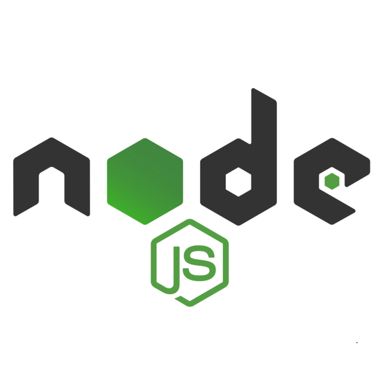
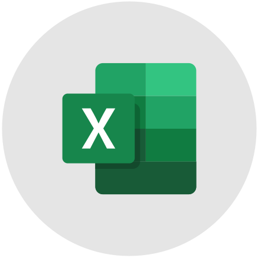

  
    
 

 
<b>Hi, there!</b>

 

  
  
  
   
  

_____

  

     
  
  
  
  
  
  
  

     
  
  

______________________

     

<table>
    <tbody>
        <tr>
            <td align="center" width="60%">
                <b>
Central de Vereadores
</b></a>
                
<a href="https://github.com/marianavns/central-de-vereadores">API com informações dos vereadores eleitos</a> na cidade de Jaboatão dos Guararapes nas eleições de 2020.

                
            </td>
            <td align="center" width="90%">
                <b>
Amiga, Help!
</b>
                
<a href="https://github.com/marianavns/amiga-help">API que reúne mulheres da área de tecnologia</a> para solução de dúvidas.  Projeto de conclusão do bootcamp @{reprograma}.

                
            </td>
		</tr>
		 <tr>
            <td align="center" width="60%">
                <b>
To Do List
</b>
                
<a href="https://github.com/marianavns/nodejs-api-rest-authentication">API para gerenciar tarefas</a> a serem feitas num projeto em equipe ou individual.

                
            </td>
            <td align="center" width="90%">
                <b>
Gerenciamento de Livraria
</b>
                
<a href="https://github.com/marianavns/rest-api-project-3-mongo">API que gerencia estoque e venda de livros e colaboradores</a> de uma livraria.

                
            </td>
		</tr>
        <tr>
            <td align="center" width="50%">
                <b>
Página de login do Instagram
</b>
                
<a href="https://github.com/marianavns/rest-api-project-3-mongo">Réplica da página de login</a> do Instagram

                
            </td>
            <td align="center" width="90%">
                <b>
Desenhos feitos em Javascript
</b>
                
<a href="https://github.com/marianavns/logica-desenhando-com-javascript">Imagens construídas em Javascript com auxílio da API Canvas (HTML)

                
            </td>
        </tr>
	</tbody>
</table>

>  Loading README...

